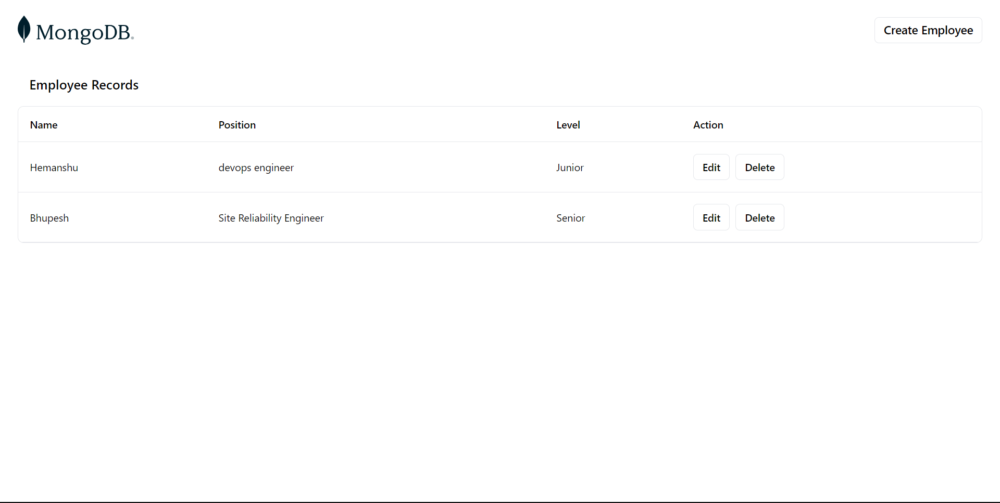

<h1 align="center"> DevSecOps-Workflow-With-Mern-Stack-Application ♾️🛡️ </h1>

<br>

## Pre-Requisite : ##

<b> • VS Code (Your intuitive code editor) </b> <br>
<b> • Git (Reliable version control for your code) </b> <br>
<b> • GitHub (Collaborative code repository) </b> <br>
<b> • Docker (Containerization made simple) </b> <br>
<b> • Helm (Orchestrate Kubernetes with ease) </b> <br>
<b> • Trivy (Quick vulnerability scanning) </b> <br>
<b> • Kubelinter (Linting for Kubernetes best practices) </b> <br>
<b> • Kyverno (Policy management for Kubernetes) </b> <br>
<b> • Flux CD (Automated GitOps deployment) </b> <br>
<b> • AKS (Managed Kubernetes on Azure) </b> <br>
<b> • Falco (Real-time cloud security monitoring) </b> <br>

<br>

<h2 align="center"> Let's Begin ✌🏻 </h2>

<br>

<h2 align="center"> 1) Build & Compose Mern Application With Docker :- </h2>

<br>

### Check Out Following Docker Images :

<a href="mern/frontend/Dockerfile">• frontend</a> <br>
<a href="mern/backend/Dockerfile">• backend</a> <br>

<br>

### Create a network for the docker containers :

<br>

`docker network create demo`

<br>

### Build the client :

<br>

```sh
cd mern/frontend
docker build -t mern-frontend .
```
<br>

### Run the client :

<br>

`docker run --name=frontend --network=demo -d -p 5173:5173 mern-frontend`

<br>

### Verify the client is running :

<br>

Open your browser and type `http://localhost:5173`

<br>

### Run the mongodb container :

<br>

`docker run --network=demo --name mongodb -d -p 27017:27017 -v ~/opt/data:/data/db mongo:latest`

<br>

### Build the server :

<br>

```sh
cd mern/backend
docker build -t mern-backend .
```

<br>

### Run the server :

<br>

`docker run --name=backend --network=demo -d -p 5050:5050 mern-backend`

<br>

## Using Docker Compose :

<br>

`docker compose up -d`

<br>

<h2 align="center"> 2) Packaging With Helm :- </h2>

<br>

###  Create a Helm Chart :

<br>

` Create a Helm Chart `

<br>

### Edit Following Files Of Helm :

<br>

<a href="mern-app/Chart.yaml">• chart.yaml</a> <br>
<a href="mern-app/values.yaml">• values.yaml</a> <br>
<a href="mern-app/templates/deployment.yaml">• templates/deployment.yaml</a> <br>
<a href="mern-app/templates/service.yaml">• templates/service.yaml</a> <br>

<br>

<h2 align="center"> 3) Scan the Helm Chart with Trivy & Kubelinter :- </h2>

<br>

### Run Trivy to scan your Helm chart :

<br>

` trivy fs --severity HIGH,CRITICAL ./mern-app > trivy-report.txt `

<br>

<a href="trivy-report.txt"> • Scanned With Trivy But Did Not Find Any vulnerability</a> <br>

<br>

### Lint the Helm Chart with KubeLinter :

<br>

helm lint ./mern-app > <a href="helmlinter-report.txt"> helmlinter-report.txt </a> <br>

<br>

<b> • Found Error At hemlinter.report.txt </b> 

<br>

<b> Here Is The Soln : </b> 

<br>

```
Create file " mern-app.fullname.tpl " --> Paste : {{ .Release.Name }}-{{ .Chart.Name }}
Replace With " mern-app.fullname.tpl " At The Place Of " mern-app.fullname "in <a href="mern-app/templates/tests/test-connection.yaml">test-connection.yaml</a>
```

<br>

<h2 align="center"> 4) Set Up AKS (Azure Kubernetes Service) & Flux CD :- </h2>

<br> 

<h3 align="center"> Set Up Your AKS Cluster :- </h3>

<br>

### Log in to your Azure account :

<br>

` az login ` 

<br>

### Create a Resource Group :

<br>

` az group create --name myResourceGroup --location eastus ` 

<br>

### Create an AKS Cluster :

<br>

``` 
az aks create \
    --resource-group myResourceGroup \
    --name myAKSCluster \
    --node-count 3 \
    --enable-addons monitoring \
    --generate-ssh-keys
    
``` 
<br>

### Get AKS Credentials :

<br>

` az aks get-credentials --resource-group myResourceGroup --name myAKSCluster `

<br>

### Verify AKS Cluster :

<br>

` kubectl get nodes ` 

<br>

<h3 align="center"> Set Up Flux CD :- </h3>

<br>

### Install Flux CLI :

<br>

` brew install fluxcd/tap/flux `

<br>

### Bootstrap Flux CD :

<br>

``` 

flux bootstrap github \
  --token-auth \
  --owner=BhupeshCraft \
  --repository=DevSecOps-Workflow-With-Mern-Stack-Application \
  --branch=main \
  --path=clusters/my-cluster \
  --personal

```
<br>

### Verify Installation :

<br>

` kubectl get pods -n flux-system `

<br>

<h2 align="center"> 5) Deploy Your Helm Chart & Kyverno Policy with Flux CD :- </h2> 

<br>

### Structure :

<br>

```

├── clusters/my-cluster/flux-system :
                            ├── helm-repo.yaml
                            ├── helm-release.yaml
                            └── secure-policies.yaml

```
<br>

### Add & Push To clusters/my-cluster/flux-system Repo :

<br>

<a href="clusters/my-cluster/flux-system/helm-repo.yaml"> • helm-repo.yaml </a> <br>
<a href="clusters/my-cluster/flux-system/helm-release.yaml"> • helm-release.yaml </a> <br>
<a href="clusters/my-cluster/flux-system/kyverno-policy.yaml"> • kyverno-policy.yaml </a> <br>

<br>

### Trigger Flux Reconciliation :

<br>

` flux reconcile kustomization flux-system --with-source ` 

<br>

### Verify The Deployment :

<br>

<b> 1. Check Flux Kustomizations --- </b> <br>

<br>

` flux get kustomizations ` 

<b> 2. Verify Heml Repository --- </b> 

<br>

` kubectl get helmrepositories -n flux-system ` 

<br>

<b> 3. Verify Helm Release --- </b> 

<br>

` flux get helmreleases -A ` 

<br>

<b> 4. Verify Kyverno Policies --- </b> 

<br>

` kubectl get cpol ` 

<br>

<b> 5. Check All Resources : </b> 

<br>

` kubectl get all -n default ` 

<br>

<h2 align="center"> 6) Integration Of Falco :- </h2> 

<br>

### Add Falco Helm Repository :

<br>

` helm repo add falcosecurity https://falcosecurity.github.io/charts ` 

<br>

` helm repo update `

<br>

### Structure : 

<br>

```

├── falco/
│   ├── falco-values.yaml  # Custom configuration for Falco
│   ├── custom-rules.yaml  # Custom Falco rules
│
├── audit-policy.yaml  # Kubernetes audit policy
└── README.md

```

<br>

` NOTE : Following Steps We Have To Apply On AKS Cluster `

<br>

### Custom Configuration for Falco : 

<br>

<a href="falco/falco-values.yaml"> • falco-values.yaml </a> 

<br>

### Install Falco With Custom Values : 

<br>

` helm install falco falcosecurity/falco --namespace falco --create-namespace -f falco/falco-values.yaml `

<br>

### Create Audit Policy File : 

<br>

<a href="falco/audit-policy.yaml"> • audit-policy.yaml </a>

<br>

### Apply Audit Policy : 

<br>

` kubectl apply -f audit-policy.yaml `

<br>

### Create Custom Rules : 

<br>

<a href="falco/custom-rules.yaml"> • custom-rules.yaml </a> 

<br>

### Apply Custom Rules : 

` kubectl apply -f falco/custom-rules.yaml ` 

<br>

### Monitor Falco Logs : 

` kubectl logs -l app=falco -n falco `

<br>

<h2 align="center"> 7) Running A Project 😄 </h2> 

<br>

<h3 align="center"> Ensure Your Cluster and Tools Are Ready 👍🏻 </h3> 

<br>

### Ensure AKS Cluster Is Running :

<br>

` kubectl get nodes `

<br>

### Ensure Flux CD Is Synchronizing :

<br>

` flux get kustomizations `

<br>

<h3 align="center"> Check Flux CD Synchronization 👍🏻 </h3>

<br>

### Check HelmRepository :

<br>

` kubectl get helmrepositories -n flux-system `

<br>

### Check HelmRelease :

<br>

` flux get helmreleases -A `

<br>

<h3 align="center"> Verify Your Deployment 👍🏻 </h3>

<br>

### Verify HelmRelease Deployment :

<br>

` kubectl get all -n default `

<br>

### Check Service Status :

<br>

` kubectl get svc -n default `

<br>

<h3 align="center"> Access Your Application 👍🏻 </h3>

<br>

### Port Forwarding (Local Access) : 

<br>

` kubectl port-forward svc/frontend 8080:80 -n default `

<br>

### External Access (Load Balancer): 

<br>

` kubectl get svc -n default `

<br>

<h3 align="center"> Monitor and Manage 👍🏻 </h3>

<br>

### Monitor Falco Logs :

<br>

` kubectl logs -l app=falco -n falco `

<br>

### Check Kyverno Policies :

<br>

` kubectl get cpol `

<br>

<h2 align="center"> 8) Here Is An Output 🔥 </h2>

<br>



<br>

<h1 align="center"> Thank You !!! 🙏🏻 </h1> 

<br>
